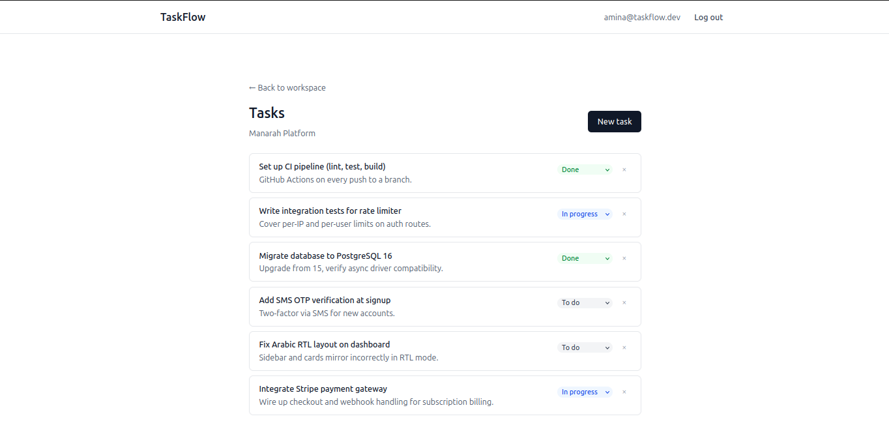
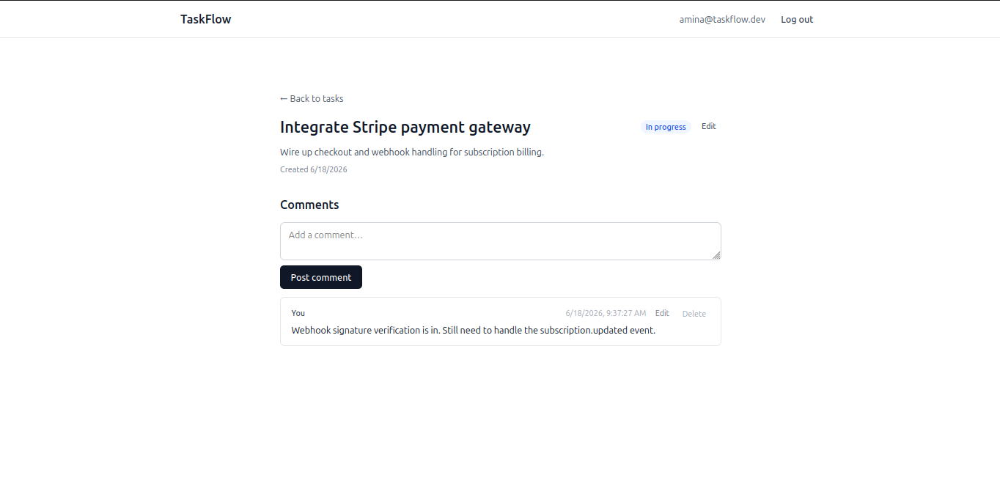
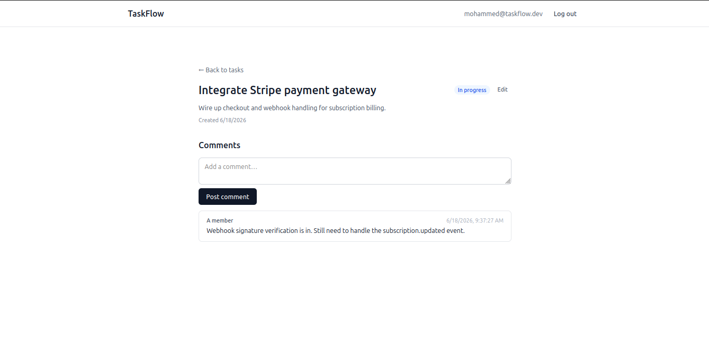
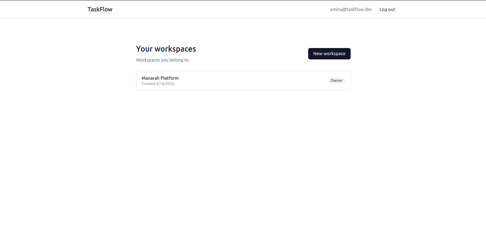
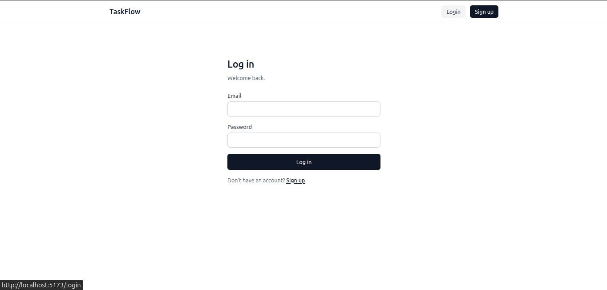
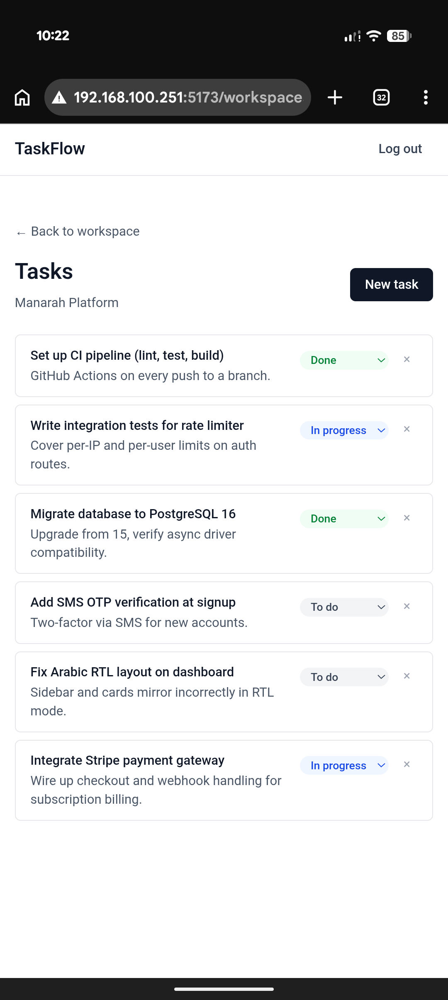

# TaskFlow

A self-hosted, multi-tenant team task manager with workspace-scoped
role-based access control — built as a portfolio project to demonstrate
production-grade engineering, not tutorial code.

The point isn't the product. It's the reasoning a senior engineer
applies *while* it works: Clean Architecture with enforced boundaries,
OWASP-aware security with the decisions documented in code, 12-factor
configuration, async Python end to end, a deploy-anywhere container
stack, and an integration test suite that proves the security
boundaries — not just the happy paths.

> **Project status**
>
> - **Phase A — Backend** · ✅ **complete** · auth, RBAC, workspaces,
>   tasks, comments, activity feed, append-only audit log, refresh
>   tokens with theft detection, rate limiting — 93 integration tests
>   against real Postgres + Redis
> - **Phase B — Frontend** · ✅ **complete** · SvelteKit web UI · full
>   CRUD across workspaces, tasks, and comments · httpOnly-cookie auth
>   with silent refresh · mobile-responsive
> - **Phase B — CLI** · 🚧 *planned* · Typer + httpx Python CLI
> - **Phase C — Cloud / Ops** · 🚧 *planned* · Kubernetes · Terraform ·
>   AWS · CI/CD · Prometheus + Grafana · tracing



---
## Repository layout

This is a monorepo. Each top-level component is independently
documented.

| Path        | Component             | Status         |
|-------------|-----------------------|----------------|
| `backend/`  | FastAPI API service   | ✅ complete     |
| `frontend/` | SvelteKit web UI      | ✅ complete     |
| `cli/`      | Python CLI (Typer)    | 🚧 coming soon  |
| `docs/`     | Project documentation | ✅ live         |

> The `frontend/` SvelteKit app consumes the same API documented here —
> the backend is API-first, so the UI was built entirely against its
> OpenAPI contract. The `cli/` (Typer) lands in Phase B alongside it.

---

## Why this project is interesting

- **Security is designed, not bolted on.**
  - Login is constant-time — wrong password and unknown account return
    byte-identical responses (measured timing ratio ~1.04)
  - Cross-tenant access returns a 404 identical to "does not exist" —
    resource existence is never disclosed
  - Refresh tokens rotate single-use; a replayed token kills the whole
    token family
  - Each defense names the OWASP risk it addresses, in the code

- **Architecture has rules, and they're enforced.**
  - Dependencies point inward — the domain layer knows nothing about
    HTTP, SQL, or Redis
  - Services own transactions; repositories speak SQL
  - Consistent across every feature, not aspirational

- **Boundaries are tracked, not hidden.**
  - Deliberate design limits are filed as tracked issues and named in
    the docs — not silently left for a reviewer to find
  - Knowing and recording what a system *doesn't* do is part of the
    work

The depth lives in [`/docs`](./docs).

---

## Quickstart (5 minutes)

Requires Docker and Docker Compose. No local Python, Postgres, or
Redis needed.

```bash
git clone https://github.com/el-amin-dev/taskflow.git
cd taskflow
cp backend/.env.example backend/.env
docker compose up -d
```

Wait ~10 seconds for healthchecks, then verify:

```bash
curl http://localhost:8000/health
# {"status":"ok","uptime_seconds":12.4}

curl http://localhost:8000/ready
# {"status":"ready","checks":{"postgres":"ok"}}
```

Apply migrations (one-time):

```bash
docker compose exec api alembic upgrade head
```

Walk the auth flow:

```bash
# 1. register
curl -X POST http://localhost:8000/v1/auth/register \
  -H 'Content-Type: application/json' \
  -d '{"email":"alice@example.com","password":"a-strong-passphrase"}'

# 2. log in, capture the token
TOKEN=$(curl -s -X POST http://localhost:8000/v1/auth/login \
  -H 'Content-Type: application/json' \
  -d '{"email":"alice@example.com","password":"a-strong-passphrase"}' \
  | python -c "import sys,json; print(json.load(sys.stdin)['access_token'])")

# 3. use it
curl http://localhost:8000/v1/auth/me \
  -H "Authorization: Bearer $TOKEN"
```

Interactive API docs (served live by the backend):

- **Swagger UI** — http://localhost:8000/docs
- **ReDoc** — http://localhost:8000/redoc
- **OpenAPI spec** — http://localhost:8000/openapi.json

---

## What it does

- A **workspace** is a tenant
- Users register, create workspaces, invite others with a role —
  `admin`, `member`, or `viewer`
- Everything else is scoped to a workspace and gated by that role

| Capability    | Summary                                                         |
|---------------|-----------------------------------------------------------------|
| Auth          | Register, JWT login, `/me`, single-use refresh rotation, logout |
| Workspaces    | Create, invite/remove members, per-workspace roles              |
| Tasks         | CRUD scoped to a workspace, status, assignee, soft delete       |
| Comments      | Threaded on tasks, author-or-admin moderation, soft delete      |
| Activity feed | Member-readable stream of workspace events                      |
| Audit log     | Append-only, admin-readable, keyset-paginated                   |
| Rate limiting | Redis-backed, per-identity                                      |

Full route inventory and the uniform error contract:
[`docs/API.md`](./docs/API.md).

---

## Web UI

A SvelteKit single-page app built entirely against the backend's OpenAPI
contract — full CRUD across workspaces, tasks, and comments, behind
httpOnly-cookie auth with silent token refresh, responsive from phone to
desktop.

Tokens never touch client JavaScript: the SvelteKit server sets them as
httpOnly cookies and proxies the API, so an XSS bug can't exfiltrate a
session. Every page is guarded server-side (deny-by-default), and the UI
honours the same non-disclosure rules as the API — a resource you can't
access simply "doesn't exist."

**The permission model, made visible.** The same comment, viewed by its
author and by another member — the author gets edit/delete controls and a
"You" label; everyone else sees "A member" and no controls. The UI enforces
what the API enforces.

| Author's view | Another member's view |
|---|---|
|  |  |

**Workspaces** — each a tenant; the list shows your role at a glance.



**Sign-in** and **mobile** — clean auth, and the same board on a phone:

| Sign in | Mobile |
|---|---|
|  |  |

### Run the UI

> The Compose stack (`docker compose up`) runs the **backend** only. The
> web UI runs separately in dev:

```bash
cd frontend
cp .env.example .env        # sets VITE_API_URL to the local backend
npm install
npm run dev                 # http://localhost:5173
```

It expects the backend from the [Quickstart](#quickstart-5-minutes) to be
running. Build details and the auth/cookie design:
[`frontend/AUTH.md`](./frontend/AUTH.md).

---

## Tech stack

- **Backend** — FastAPI · SQLAlchemy 2.x (async) · asyncpg · Alembic ·
  PostgreSQL 16 · Redis 7 · Pydantic v2 · argon2-cffi · PyJWT ·
  slowapi · pytest
- **Containers** — Docker · Docker Compose · multi-stage build ·
  non-root runtime user
- **Frontend** — SvelteKit (Svelte 5 runes) · TypeScript · TailwindCSS v4 ·
  adapter-node (server-set httpOnly cookies)
- **CLI** *(Phase B)* — Typer · httpx
- **Infra** *(Phase C)* — Kubernetes · Terraform · AWS ·
  Prometheus · Grafana · OpenTelemetry

---

## Documentation

| Doc                                            | What's in it                                               |
|------------------------------------------------|------------------------------------------------------------|
| [docs/ARCHITECTURE.md](./docs/ARCHITECTURE.md) | The layers, the dependency rule, transaction ownership     |
| [docs/SECURITY.md](./docs/SECURITY.md)         | Threat model, the OWASP map, the non-disclosure discipline |
| [docs/API.md](./docs/API.md)                   | Every endpoint, the unified error contract, the auth model |
| [docs/DEVELOPMENT.md](./docs/DEVELOPMENT.md)   | Run it, test it, add a migration, the contribution loop    |
| [docs/DECISIONS.md](./docs/DECISIONS.md)       | The "why" behind the locked design choices                 |

---

## Development discipline

- Every change: open an Issue → branch off `main` → atomic
  [conventional commits](https://www.conventionalcommits.org/) →
  squash-merge with `closes #N`
- History is meant to be read
- Details: [`docs/DEVELOPMENT.md`](./docs/DEVELOPMENT.md)

---

## License

MIT — see [LICENSE](./LICENSE).
