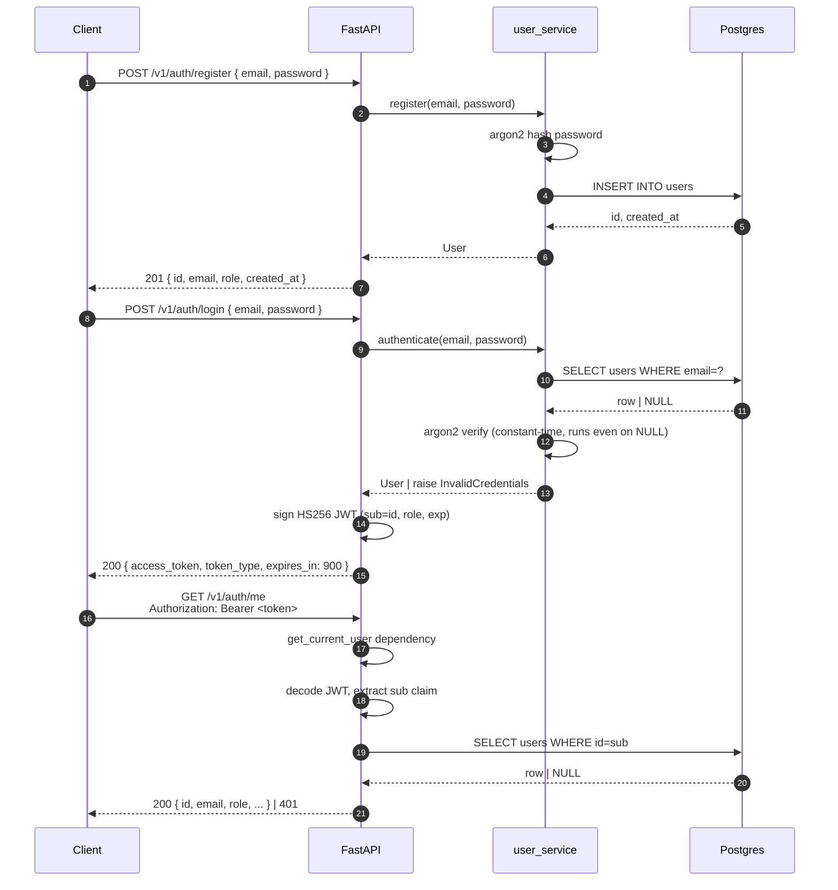

# TaskFlow

A self-hosted team task manager with workspace-scoped role-based access control. Built as a portfolio project to demonstrate production-grade backend engineering: 12-factor design, OWASP-aware security, Clean Architecture, async Python, and a deploy-anywhere container stack.

> **Status:** Phase A — Backend foundations *(in progress)*. Auth (register + JWT login + `/me`) is live. RBAC, workspaces, and tasks are next.

---

## Tech Stack

**Backend.** FastAPI · SQLAlchemy 2.x async · asyncpg · Alembic · PostgreSQL 16 · Redis 7 · Pydantic v2 · argon2-cffi · PyJWT · pytest

**Containers.** Docker · docker compose · multi-stage builds · non-root runtime user

**Frontend** *(planned, Phase B)*. SvelteKit · TailwindCSS

**CLI** *(planned, Phase B)*. Typer · httpx

**Infra** *(planned, Phase C)*. Kubernetes · Terraform · AWS · Prometheus · Grafana

---

## Quickstart

Requires Docker and docker compose. Clone, copy env, run.

```bash
git clone https://github.com/el-amin-dev/taskflow.git
cd taskflow
cp backend/.env.example backend/.env
docker compose up -d
```

Wait ~10 seconds for healthchecks, then verify:

```bash
curl http://localhost:8000/health
# {"status":"ok","uptime_seconds":3}

curl http://localhost:8000/ready
# {"status":"ready","checks":{"postgres":"ok"}}
```

Apply database migrations (one-time):

```bash
docker compose exec api alembic upgrade head
```

Try the full auth flow:

```bash
# 1. register a user
curl -X POST http://localhost:8000/v1/auth/register \
  -H 'Content-Type: application/json' \
  -d '{"email":"alice@example.com","password":"hunter2pass"}'

# 2. log in and capture the access token
TOKEN=$(curl -s -X POST http://localhost:8000/v1/auth/login \
  -H 'Content-Type: application/json' \
  -d '{"email":"alice@example.com","password":"hunter2pass"}' \
  | python -c "import sys, json; print(json.load(sys.stdin)['access_token'])")

# 3. use the token to fetch your own profile
curl http://localhost:8000/v1/auth/me \
  -H "Authorization: Bearer $TOKEN"
```

---

## Architecture

Clean Architecture layout: dependencies point inward. HTTP, the database, and external clients are all infrastructure concerns; the domain knows nothing about them.

```
backend/app/
├── api/         — HTTP routes (FastAPI), Pydantic schemas (request/response only)
│   ├── dependencies.py  — reusable Depends() targets (get_current_user)
│   └── v1/auth.py       — /v1/auth/{register,login,me}
├── services/    — business logic, owns transactions
│   └── user_service.py  — register(), authenticate()
├── domain/      — pure types (dataclasses, enums) — no framework imports
│   └── user.py          — Role enum, frozen User dataclass
├── infra/       — DB engine, ORM models, repositories, security helpers
│   ├── db.py
│   ├── models.py
│   ├── security.py      — argon2 + JWT helpers
│   └── repositories/user_repo.py
└── core/        — config, logging
```

Migrations live in `backend/migrations/` (Alembic, async). Tests live in `backend/tests/` (pytest, async, integration against real Postgres in compose).

---

## Auth Flow



### Error Responses

All API errors share a unified shape:

```json
{
  "detail": {
    "detail": "human-readable message",
    "code": "machine-readable-slug"
  }
}
```

Defined codes:

| Code                  | When                                          | HTTP |
|-----------------------|-----------------------------------------------|------|
| `email_unavailable`   | Registering an email already in use           | 400  |
| `invalid_credentials` | Login failed (any reason)                     | 401  |
| `invalid_token`       | Bearer token missing, malformed, or expired   | 401  |

**Security note (OWASP A07).** Login failures and token failures return *byte-identical* response bodies regardless of cause. An attacker cannot distinguish "wrong password" from "no such user" by status, body, or timing — the service runs an argon2 verify even when the email doesn't exist (measured timing ratio: ~1.04 between the two paths). This is enforced by a test (`test_login_unknown_email_same_response_as_wrong_password`).

---

## Status

**Phase A — Backend foundations**

- [x] Layered scaffold + pinned dependencies
- [x] Typed env-driven config (12-factor §III)
- [x] Structured JSON logging (12-factor §XI)
- [x] FastAPI entrypoint + `/health` + `/ready` (real DB check)
- [x] Dockerized stack (api + postgres + redis), non-root runtime
- [x] Async SQLAlchemy engine + db readiness probe
- [x] Alembic migrations (async template, baseline applied)
- [x] User model (UUID PK, indexed email, argon2 hashed password)
- [x] `POST /v1/auth/register` with full vertical slice + integration tests
- [x] `POST /v1/auth/login` — JWT issuance (HS256, 15min TTL)
- [x] `GET /v1/auth/me` — JWT verification via `get_current_user` dependency
- [ ] Workspaces + memberships + RBAC enforcement
- [ ] Tasks with assignment, status, deadlines
- [ ] Comments + activity feed
- [ ] Rate limiting (slowapi)
- [ ] Audit log
- [ ] Refresh tokens (separate Issue — rotation, blacklist, family detection)

**Phase B — Frontend + CLI** *(not started)*

- [ ] SvelteKit web app
- [ ] Python CLI (Typer + httpx)

**Phase C — Production deploy** *(not started)*

- [ ] CI/CD pipeline (GitHub Actions: lint, typecheck, test, build image)
- [ ] Kubernetes manifests + Helm chart
- [ ] Terraform AWS infra (ECS/EKS, RDS, ElastiCache)
- [ ] Prometheus metrics + Grafana dashboards
- [ ] OpenTelemetry tracing + correlation IDs

---

## Development Discipline

Every change goes through the same loop:

1. Open a GitHub Issue describing the work.
2. Branch off `main` (`feat/`, `fix/`, `docs/`, `refactor/`).
3. Commit using [conventional commits](https://www.conventionalcommits.org/) — `feat(scope):`, `fix(scope):`, `test:`, `docs:`, `refactor:`. One Issue → one PR → multiple atomic commits when warranted.
4. Squash-merge to `main` with `closes #N` so the Issue auto-closes.

Security decisions are explicit and reference [OWASP Top 10 (2021)](https://owasp.org/Top10/) where relevant. Already enforced and tested:

- **A02** (Cryptographic Failures) — argon2id password hashing, HS256 JWT signed with 32+ char secret, no secrets in committed config (alembic.ini `sqlalchemy.url` is intentionally empty).
- **A03** (Injection) — parameterized queries via SQLAlchemy ORM, no string-concat SQL.
- **A05** (Security Misconfiguration) — non-root container user (uid 1001), `.env` gitignored.
- **A07** (Auth Failures) — constant-time login, unified 401 for any auth failure, no email enumeration on registration, single `InvalidToken` exception flattens all JWT decode failures, HS256 hardcoded in decoder (prevents algorithm confusion).
- **A09** (Logging Failures) — `hashed_password` never appears in API responses (asserted by test).

---

## License

MIT — see [LICENSE](./LICENSE).
