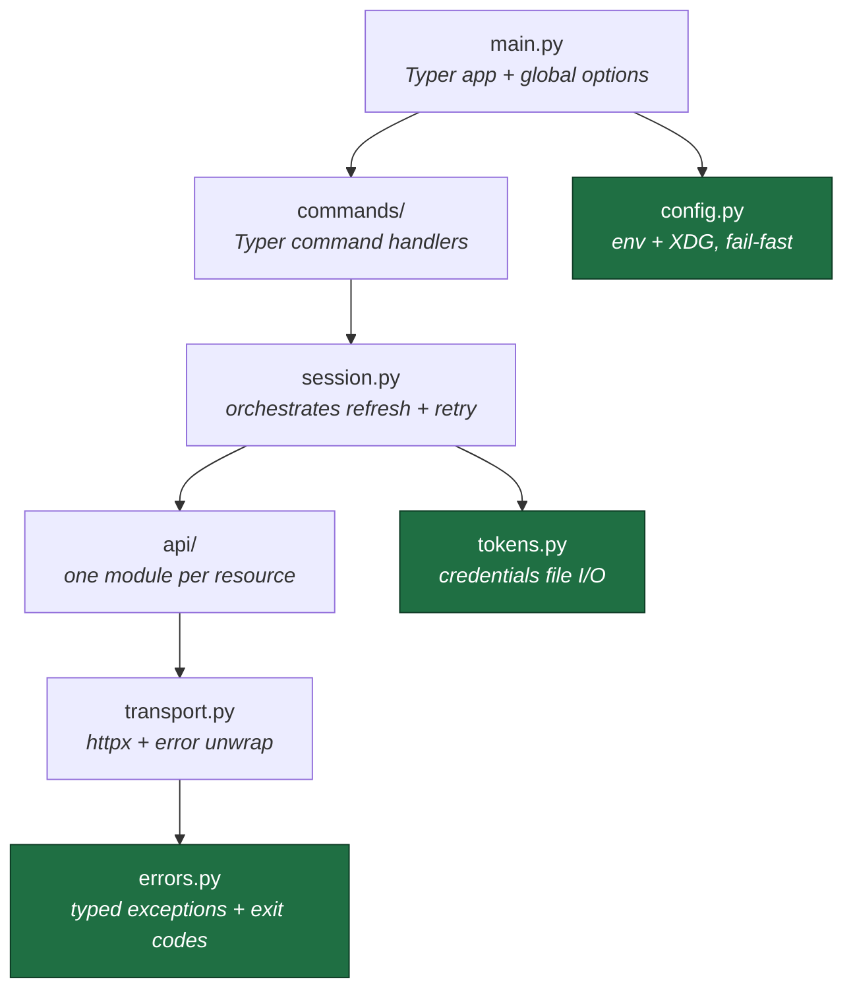
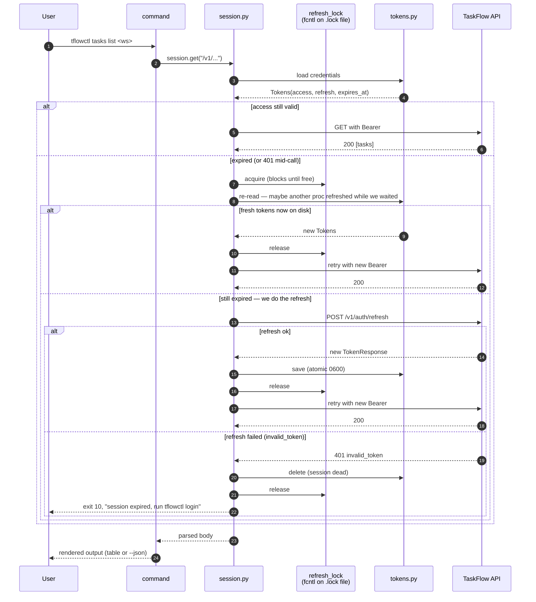
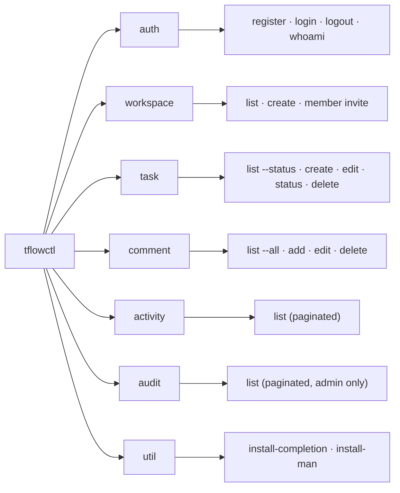

# TaskFlow CLI — Work Track

**Repo:** github.com/el-amin-dev/taskflow · **Path:** `cli/` · **Phase:** B (frontend + CLI)

The plan for the Python CLI client (Typer + httpx). Each PR is independently
mergeable; the order is chosen so the system stays end-to-end testable after
every merge.

---

## Architecture

Dependencies point one way — outer layers know inner layers, never the reverse.
Same rule the backend enforces.



| Layer          | Responsibility                                            | May import                          |
|----------------|-----------------------------------------------------------|-------------------------------------|
| `main.py`      | Typer entrypoint, global options, exit-code translation   | every layer                         |
| `commands/`    | Typer command handlers; argv → session call → output      | `session`, `api`, `errors`          |
| `session.py`   | Loads tokens, refreshes inside the lock, retries on 401   | `tokens`, `api`, `transport`        |
| `api/`         | One module per resource: thin wire wrappers               | `transport`                         |
| `transport.py` | `httpx.Client` wrapper that unwraps the error envelope    | `errors`                            |
| `errors.py`    | Exception hierarchy + exit-code mapping                   | —                                   |
| `tokens.py`    | Atomic 0600 credentials I/O + refresh lock                | —                                   |
| `config.py`    | Env-driven config, XDG paths, fail-fast                   | —                                   |

---

## Auth + refresh flow

The CLI-specific evening-killer: two concurrent invocations can't spend the same
single-use refresh token. The file lock is the only thing standing between you
and a "randomly logged out" bug.



**Key invariants:**

- Refresh tokens are **single-use** server-side. Replay = theft = family kill.
- The lock is held across read-call-write — never just the file write.
- A failed refresh deletes the credentials file. The next command runs anonymous.
- `--json` is pure JSON to stdout; chatter (status, prompts, errors) goes to stderr.

---

## Command surface (target)



---

## PR plan

Each PR opens its own Issue first, follows the project convention
(branch → atomic conventional commits → PR → squash-merge with `closes #N`).

### PR 1 — Scaffold + Auth — *in progress* (Issue #100)

**Branch:** `feat/cli-scaffold`

Foundations + complete auth surface. Lays the architecture; later PRs only add
resource modules on top.

- [x] `pyproject.toml`, src layout, `tflowctl` entrypoint
- [x] `config.py` — env-driven, XDG, fail-fast
- [x] `tokens.py` — atomic 0600 + refresh lock
- [x] `errors.py` — exception hierarchy + exit codes
- [x] `transport.py` — httpx wrapper + envelope unwrap
- [x] `api/auth.py` — register/login/refresh/logout/me
- [ ] `session.py` — token load + refresh-on-401 + lock orchestration
- [ ] `commands/auth.py` — `tflowctl auth login/logout/whoami/register`
- [ ] `--json` mode + exit-code wiring in `main.py`
- [ ] `cli/README.md`

**Out of scope (own PRs):** workspaces, tasks, comments, activity, audit, man
page, shell-completion install helper.

---

### PR 2 — Workspaces + Members invite

**Suggested branch:** `feat/cli-workspaces`

- `api/workspaces.py`, `api/members.py`
- `commands/workspace.py` — `list`, `create`
- `commands/member.py` — `invite` (list/remove blocked by backend #85; documented in `--help`)
- Tabular output for `list`; `--json` mode everywhere
- Honest message about the #85 gap, not a fake `list`

**Acceptance:**
- `tflowctl workspace list` shows caller's workspaces, newest first
- `tflowctl workspace create "<name>" --json` returns the new workspace
- `tflowctl member invite <ws-id> <email> --role member` → 201, exit `13 already_member` on duplicate

---

### PR 3 — Tasks

**Suggested branch:** `feat/cli-tasks`

- `api/tasks.py`
- `commands/task.py` — `list [--status]`, `create`, `edit`, `status`, `delete`
- Body via `-m/--message`, stdin, or `$EDITOR` (git pattern)
- "No single-task GET" workaround: list-and-filter by id (per frontend handoff §2)

**Acceptance:**
- `tflowctl task list <ws> --status todo` filters server-side
- `tflowctl task edit <ws> <task-id> --description ""` clears the field (verified `null`-clears behavior)
- `tflowctl task delete <ws> <task-id>` → 204; non-existent → exit `11 task_not_found`

---

### PR 4 — Comments (with cursor pagination)

**Suggested branch:** `feat/cli-comments`

- `api/comments.py`
- `commands/comment.py` — `list`, `add`, `edit`, `delete`
- `list` default = one page; `--limit N`, `--cursor <opaque>`, `--all` (auto-follow)
- Body via `-m`, stdin, or `$EDITOR`

**Acceptance:**
- `tflowctl comment list <task> --all` follows `next_cursor` until null
- Edit/delete someone else's comment → exit `12 not_comment_author`
- `tflowctl comment add <task> -m "..." --json` returns the comment

---

### PR 5 — Activity + Audit (read-only, paginated)

**Suggested branch:** `feat/cli-activity-audit`

- `api/activity.py`, `api/audit.py`
- `commands/activity.py` — `list <ws>` (members can read)
- `commands/audit.py` — `list <ws>` (admin only)
- Same `--limit / --cursor / --all` pattern as comments
- Newest-first (matches server contract)

**Acceptance:**
- `tflowctl activity list <ws>` returns most recent first
- Non-admin hitting `audit list` → exit `11 not found` (non-disclosure: never `403`)

---

### PR 6 — Distribution polish

**Suggested branch:** `feat/cli-distribution`

- `tflowctl --install-completion` (Typer ships this) — documented
- Hand-rolled `tflowctl.1` man page in `cli/man/`
- `tflowctl util install-man` subcommand → copies to `~/.local/share/man/man1/`, runs `mandb -u`
- `cli/README.md` polished — pipx install, env vars, exit-code table
- `pipx install .` smoke-test documented

**Acceptance:**
- `pipx install taskflow-cli` puts `tflowctl` on `$PATH`
- `man tflowctl` works after `tflowctl util install-man`
- Tab-complete works in bash and zsh after `tflowctl --install-completion`

---

## Cross-cutting principles (applied in every PR)

| Principle                          | What it looks like in code                                                                  |
|------------------------------------|---------------------------------------------------------------------------------------------|
| **12-Factor §III (config)**        | Every tunable is an env var; no constants in code that should be configurable               |
| **12-Factor §VI (stateless)**      | No process-local caches surviving the invocation; state goes to disk                        |
| **OWASP A02 + A09**                | Tokens are 0600 on disk, never logged, never in argv, never in stdout                       |
| **Non-disclosure (mirror backend)**| Map `404` to `not found` — never say "you lack permission for workspace X"                  |
| **Exit codes are an API**          | Every error path lands on a documented code; `tflowctl ... && next` works                   |
| **stdout = data, stderr = chatter**| `tflowctl task list --json \| jq` must work; spinners/progress go to stderr                 |
| **Idempotency in scripts**         | `logout`, `delete`, duplicate invite — all clean non-crash paths                            |
| **One concern per commit**         | Conventional commits; each one independently buildable                                      |

---

## Exit-code contract (scriptable)

| Code | Meaning              | Triggers                                                                                      |
|------|----------------------|-----------------------------------------------------------------------------------------------|
| `0`  | success              | normal completion                                                                             |
| `1`  | generic error        | uncaught fallback                                                                             |
| `2`  | usage error          | Typer's default for bad argv (missing required, unknown command)                              |
| `10` | auth failed          | `invalid_credentials`, `invalid_token`, session expired                                       |
| `11` | not found            | `user_not_found`, `member_not_found`, `task_not_found`, `comment_not_found`, cross-tenant 404 |
| `12` | forbidden            | `not_comment_author`                                                                          |
| `13` | conflict             | `email_unavailable`, `already_member`, `cannot_remove_owner`                                  |
| `14` | network / transport  | DNS, refused, timeout, TLS                                                                    |
| `15` | bad request          | `invalid_cursor`, 422 validation                                                              |
| `16` | server error         | any 5xx                                                                                       |

---

## Status snapshot

**Current:** PR 1, on commit 6 of ~10 · `session.py` is next, then commands and wiring.

```
019127a  feat(cli): add auth API client functions
c0e0fa7  feat(cli): add HTTP transport with typed errors
d6518e6  feat(cli): add API error hierarchy with exit codes
3c2d470  feat(cli): add token store with refresh lock
6dc8435  feat(cli): add typed config with XDG paths
c6e188e  feat(cli): add package with tflowctl entrypoint
```
