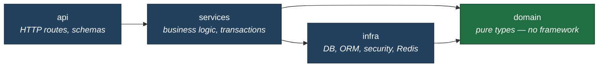
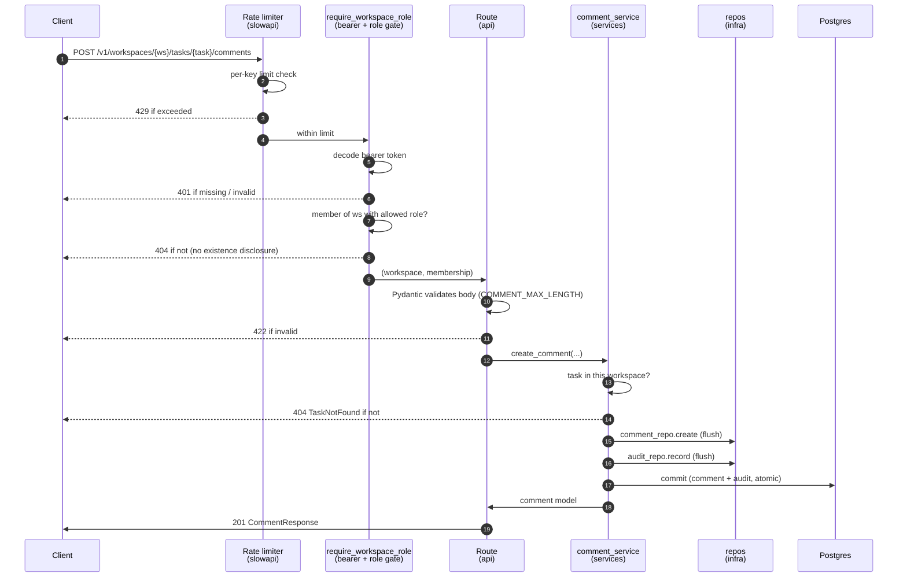

# Architecture

How TaskFlow's backend is structured, and the rules that keep it that
way.

---

## The one rule

**Dependencies point inward.** Outer layers know about inner layers;
inner layers know nothing about outer ones. The domain — the core
business types — has zero imports from FastAPI, SQLAlchemy, Redis, or
any framework. You could delete the entire HTTP layer and the domain
would still compile.

Every arrow points toward `domain`. Nothing points away from it.

- `api` depends on `services`
- `services` depends on `domain` and `infra`
- `infra` depends on `domain` (it maps to/from domain types)
- `domain` depends on **nothing** internal or framework-related

A dependency that points outward (e.g. a domain type importing a
SQLAlchemy model) is an architecture violation, not a style nit.

---

## The layers

| Layer      | Path              | Responsibility                                              | May import          |
|------------|-------------------|-------------------------------------------------------------|---------------------|
| `api`      | `app/api/`        | HTTP routes, request/response Pydantic schemas, status codes | services, domain    |
| `services` | `app/services/`   | Business logic, **owns transactions**, orchestration         | domain, infra       |
| `domain`   | `app/domain/`     | Pure types — frozen dataclasses, enums. No framework.        | (nothing)           |
| `infra`    | `app/infra/`      | DB engine, ORM models, repositories, security, rate limiter  | domain              |
| `core`     | `app/core/`       | Config (typed, env-driven), structured logging               | (stdlib + pydantic) |

### `api/`

- One router per resource: `auth.py`, `workspaces.py`, `tasks.py`,
  `comments.py`, plus `meta.py` (`/health`, `/ready`)
- Pydantic models here are **wire contracts only** — request bodies and
  response shapes. They are not domain types.
- Routes do *coarse* authorization (is the caller a member of this
  workspace at all?) via the `require_workspace_role` dependency, then
  delegate everything else to a service.

### `services/`

- Where business rules live: `user_service`, `workspace_service`,
  `task_service`, `comment_service`
- **Owns the transaction boundary.** A service method calls one or more
  repositories, then `commit`s. Repositories never commit.
- Does *fine-grained* authorization that needs data — e.g. "is the
  caller the comment's author, or a workspace admin?" — because that
  decision needs the row, which only the service has loaded.
- Raises domain-meaningful exceptions (`TaskNotFound`,
  `NotCommentAuthor`, …); the route maps those to HTTP.

### `domain/`

The pure core. Three modules, each a frozen dataclass plus its enum:

| Module        | Types                                          |
|---------------|------------------------------------------------|
| `user.py`     | `Role` (enum), `User` (frozen dataclass)       |
| `workspace.py`| `WorkspaceRole` (enum), `Workspace`, `MemberShip` |
| `task.py`     | `TaskStatus` (enum), `Task`                    |

- Enums are `(str, Enum)` — serializable, comparable, DB-friendly as
  plain strings
- Dataclasses are frozen — domain objects are values, not mutable
  state bags
- **Not every persisted thing has a domain type.** Records that are
  data, not behaviour-bearing entities — audit-log rows, comments —
  deliberately have no domain type; the service maps the ORM model
  straight to a response schema. (See
  [DECISIONS.md](./DECISIONS.md) for why.)

### `infra/`

- `db.py` — async engine lifecycle (`init_engine` / `dispose_engine` /
  `get_db`)
- `models.py` — SQLAlchemy 2.x ORM models (`Mapped[...]`,
  `mapped_column`)
- `repositories/` — one module per aggregate; **functions, not
  classes** (no premature abstraction — a class earns its place when
  it needs caching or per-call state, not before)
- `security.py` — argon2 hashing, JWT encode/decode
- `rate_limiter.py`, `refresh_store.py` — Redis-backed

### `core/`

- `config.py` — Pydantic Settings, env-driven, **fail-fast** (invalid
  config crashes at startup, not on first request). Secrets are
  `SecretStr` so they don't leak in logs/repr.
- `logging.py` — structured JSON in prod, human-readable in dev
  (12-factor §XI: logs are an event stream to stdout)

---

## Transaction ownership

A single, consistently applied rule:

- **Repositories `flush`.** A repo writes its statement and flushes so
  generated values (ids, `created_at`) populate — but does **not**
  commit.
- **Services `commit`.** The service decides the transaction boundary,
  because only the service knows the full unit of work (e.g. "create
  the comment *and* write the audit row — both or neither").

This is why a feature like "post a comment" is atomic: the comment
insert and its `comment.created` audit row commit together in one
service-owned transaction. A failure rolls back both.

---

## Request lifecycle (example: post a comment)

The diagram is the at-a-glance; the steps below are the detail. Both
describe the same real path — every cross-cutting concern (rate limit,
auth, the role gate, the transaction boundary) firing in order.

1. **`api`** — `POST /v1/workspaces/{ws}/tasks/{task}/comments`.
   `require_workspace_role({"admin","member","viewer"})` confirms the
   caller is in the workspace; Pydantic validates the body
   (`COMMENT_MAX_LENGTH`).
2. **`service`** — `comment_service.create_comment(...)`. Verifies the
   task exists *and* belongs to the workspace (cross-tenant access →
   the same `TaskNotFound` as "doesn't exist"); creates the comment via
   the repo; emits a `comment.created` audit row via the audit repo;
   **commits**.
3. **`infra`** — `comment_repo.create` flushes the insert;
   `audit_repo.record` flushes the audit row. ORM models map to/from
   nothing outward.
4. **`api`** — the route maps the returned model to `CommentResponse`
   and returns `201`.

At no point does the domain layer learn that HTTP or Postgres exists.

---

## Migrations & tests

- **Migrations** — `backend/migrations/` (Alembic, async template).
  Run as a discrete step (`alembic upgrade head`), never auto-applied
  on API startup (a race with multiple replicas). Adding one:
  [DEVELOPMENT.md](./DEVELOPMENT.md).
- **Tests** — `backend/tests/` (pytest, async). Integration-first:
  they drive the real HTTP app against real Postgres + Redis in
  Compose, asserting on security boundaries, not mocks. The OpenAPI
  contract is itself regression-locked (`test_openapi_contract` — a
  pure-spec suite that fails if the documented security scheme or
  error responses ever silently drift). Suites: `test_auth`,
  `test_workspaces`, `test_tasks`, `test_comments`, `test_activity`,
  `test_audit`, `test_refresh_flow`, `test_refresh_store`,
  `test_rate_limiter`, `test_rate_limits_applied`,
  `test_openapi_contract` — 99 tests.

---

## See also

- [SECURITY.md](./SECURITY.md) — the threat model and the OWASP map
- [API.md](./API.md) — the endpoint surface and error contract
- [DECISIONS.md](./DECISIONS.md) — *why* these choices, with tradeoffs